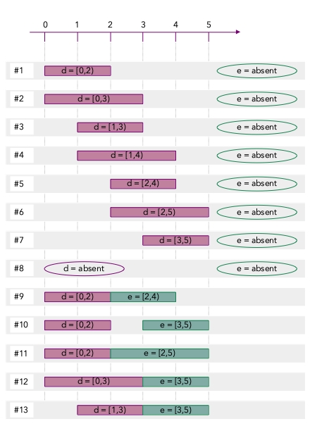

# The basics: optional interval variables, precedence and logical constraints, basic expressions


## Optional interval variables

CP Optimizer extends classical combinatorial optimization frameworks with an additional type of decision variable called *optional interval variable* (or *interval variable* in short).

Like any decision variable in combinatorial optimization, an *interval variable* is defined by a *domain*, that is, the set of possible values the variable can take in a solution.

The *value* of an interval variable `x` in a solution consists of:

* either an interval of integers `x=[s,e)` where `s` ans `e` are integer values such that `s<=e`
* or a particular value `"absent"`

When an interval variable `x` is not `absent` (we say it is `present`), if `x=[s,e)`, value `s` is the *start* of interval *x* (also denoted `s(x)`), value `e` is the *end* of interval `x` (also denoted `e(x)`) and value `e-s` is its  *length*.

In the formulation of scheduling problems, interval variables are often used to represent the interval of time over which a task, operation or activity executes. 

The initial domain of an interval varible is specified when the variable is created:

* By default an interval variable is present (that is the value `"absent"` is not in the domain of possible values). But an interval variable can be specified as being *optional* at creation time and in this case, it means that value `"absent"` is in the domain of the variable.
* At creation time an interval variable can be specified a range of values for its start, end and size value (so far, let's assume the concept of *size* is the same as the one of *length*). Those ranges constrain the domain of the interval variable when it is present.
* When no range for start, end or size is specified, the default range for these elements is supposed to be `[0,+oo)`. 

Here are 4 examples of interval variables.

> NOTE: _The detailed conventions for typesetting CP Optimizer models are available [here](../../typeset_models/README.md)_
> 

```
interval a in [0..5], size = 3
interval b in [0..5], size in [2..3]
interval c in [0..5], optional, size = 3
interval d in [0..5], optional, size in [2..3]
```

The initial domain of these interval variables is as follows:

*  `domain(a) = { [0,3), [1,4), [2,5) }`
*  `domain(b) = { [0,2), [0,3), [1,3), [1,4), [2,4), [2,5), [3,5)  }`
*  `domain(c) = { [0,3), [1,4), [2,5), absent }`
*  `domain(d) = { [0,2), [0,3), [1,3), [1,4), [2,4), [2,5), [3,5), absent  }`

These values are depicted on the figure below.


A Python program defining these variables and enumerating their possible values can be found here : [interval_domain.py](./python/interval_domain.py)

In combinatorial optimization, constraints can be posted on the different decisions variables of the problem to restrict the combination of values they can take in a feasible solution. Let's see below two very common type of constraints holding on interval variables.

## Logical constraints

Maybe the most basic constraint is the unary constraint `presenceOf(x)` that enforces that interval variable `x` has to be present. It simply says that the interval variable cannot take the value `"absent"`.

Of course, this constraint is seldom use alone as it has the same effect as not defining interval variable `x` as optional. For example defining a model:

```
interval d in [0..5], optional, size=[2..3]
presenceOf(d)
```

Would result in the same feasible solutions as when doing:

```
interval d in [0..5] size=[2..3]
```

In general, constraints of this type are combined together using logical constraints like `or` (`||`), `not` (`!`), `implications` (`=>`).

Consider for example the following model (`c` and `d` are the interval variables whose domain was depicted on the figure above):

```
presenceOf(c) => !presenceOf(d)
interval c in [0..5], optional, size=3
interval d in [0..5], optional, size=[2..3]
```

It means that interval variables `c` and `d` cannot be both present in a feasible solution.

Can you think of the different feasible solutions to this problem ? How many different solutions exist ? 0 ? 10 ? 11 ? 21 ? 32 ? 

...

The right answer is of course 11. By going through the cartesian product of the values of `c` (4 values) and `d` (8 values) and removing all the combinations that violate constraint `presenceOf(c) => !presenceOf(d)`, we see that the only possible combinations are:

```
Solution #01:  c=[0,3)   d=absent
Solution #02:  c=[1,4)   d=absent
Solution #03:  c=[2,5)   d=absent
Solution #04:  c=absent  d=absent
Solution #05:  c=absent  d=[0,2)
Solution #06:  c=absent  d=[0,3)
Solution #07:  c=absent  d=[1,3)
Solution #08:  c=absent  d=[1,4)
Solution #09:  c=absent  d=[2,4)
Solution #10:  c=absent  d=[2,5)
Solution #11:  c=absent  d=[3,5)
```

In CP Optimizer models, binary logical expressions on presence status of interval variables are common, for instance:

* `presenceOf(x)==presenceOf(y)` means that the two interval variables are either both present or both absent. It can be the case of two operations belonging to the same optional production process: if the process is executed then both operations will be present whereas if the process is not executed, both interval variables will be absent.

* `presenceOf(x)=>presenceOf(y)` may for instance be used in a context where `y` represents an operation that produces some material necessary for the activity represented by interval `x`. So whenever activity `x` is present, the operation represented by `y` must also be present in order to produce the necessary input material. But the operation represented by `y` can also be present for other purposes. This type of implication is also used in a frequent modeling pattern called [optional interval chains](../optional_interval_chain/README.md).

* `presenceOf(x)=>!presenceOf(y)` means (like in the above example) that the interval variables cannot both be present. This may represent an incompatibility between the two operations represented by the interval variables.

Constraints `presenceOf` can also be combined as numerical expressions. For instance the model below adds an objective function to the previous model that aims at maximizing the number of present intervals in a solution.

```
maximize presenceOf(c)+presenceOf(d)
presenceOf(c) => !presenceOf(d)
interval c in [0..5], optional, size=3
interval d in [0..5], optional, size=[2..3]
```

For this model, all the feasible solutions are optimal with objective value `1` except for solution `#04` that has an objective value `0`.

A Python program defining this problem and using CP Optimizer to compute an optimal solution can be found here : [interval_logical.py](./python/interval_logical.py)


## Precedence constraints

Temporal constraints between activities are ubiquitous in scheduling problems. They are usually modeled as precedence constraints between interval variables.

The most common precedence constraint is `endBeforeStart(x,y)`, it tells that whenever both interval variables `x` and `y` are present then the end value of `x` is lower or equal to the start value of `y`. When `x` or `y` is absent, or when they are both absent, the constraint is satisfied.

More formally the semantics of `endBeforeStart(x,y)` is:

```
endBeforeStart(x,y)  <=>  (x!=absent)&&(y!=absent) => e(x)<=s(y)
```

Consider for example the following problem:

```
presenceOf(e) => presenceOf(d)
endBeforeStart(d,e)
interval d in [0..5], optional, size=[2..3]
interval e in [0..5], optional, size=[2..3]
```

The complete set of solutions to this problem is as follows:

```
Solution #01:  d=[0,2)   e=absent
Solution #02:  d=[0,3)   e=absent
Solution #03:  d=[1,3)   e=absent
Solution #04:  d=[1,4)   e=absent
Solution #05:  d=[2,4)   e=absent
Solution #06:  d=[2,5)   e=absent
Solution #07:  d=[3,5)   e=absent
Solution #08:  d=absent  e=absent
Solution #09:  d=[0,2)   e=[2,4)
Solution #10:  d=[0,2)   e=[3,5)
Solution #11:  d=[0,2)   e=[2,5)
Solution #12:  d=[0,3)   e=[3,5)
Solution #13:  d=[1,3)   e=[3,5)
```

A graphical illustration is shown on the figure below.



A minimal delay `z` (either an integer constant or an integer variable) can be given in the precedence constraint (it is assumed to be `0` when not specified). Other variants of precedence constraints are defined depending on the interval endpoints and the fact the delay is a minimal or an exact delay between the interval endpoints. The semantics of the complete set of precedence constraints available in CP Optimizer is as follows.

```
endBeforeStart  (x,y,z) <=> (x!=absent)&&(y!=absent) => e(x)+z <= s(y)
endBeforeEnd    (x,y,z) <=> (x!=absent)&&(y!=absent) => e(x)+z <= e(y)
startBeforeStart(x,y,z) <=> (x!=absent)&&(y!=absent) => s(x)+z <= s(y)
startBeforeEnd  (x,y,z) <=> (x!=absent)&&(y!=absent) => s(x)+z <= e(y)
endAtStart      (x,y,z) <=> (x!=absent)&&(y!=absent) => e(x)+z == s(y)
endAtEnd        (x,y,z) <=> (x!=absent)&&(y!=absent) => e(x)+z == e(y)
startAtStart    (x,y,z) <=> (x!=absent)&&(y!=absent) => s(x)+z == s(y)
startAtEnd      (x,y,z) <=> (x!=absent)&&(y!=absent) => s(x)+z == e(y)
```

## Basic expressions

While the set of constraints on interval variables (logical and precedence constraints, span, alternative, constraints on sequence variables, state and cumul functions) is in general sufficient to express most of the constraints of a scheduling problem, some integer expressions returning the values (start, end, length) of interval variables are required, in particular for expressing the objective function.

The integer expression `endOf(x,V)` where `x` is an interval variable and `V` an integer value returns the end value of `x` when `x` is present and returns value `V` when interval `x` is absent. Similar expressions are available for the `start` and `length`. Their formal semantics is as follows.

```
endOf(x,V)    =   e(x)       if (x!=absent)
              =   V          if (x==absent)
              
startOf(x,V)  =   s(x)       if (x!=absent)
              =   V          if (x==absent)
              
lengthOf(x,V) =   e(x)-s(x)  if (x!=absent)
              =   V          if (x==absent)     
```

Let's consider the model of the previous section where we add and objective function:

```
minimize endOf(d,1)+endOf(e,5)
presenceOf(e) => presenceOf(d)
endBeforeStart(d,e)
interval d in [0..5], optional, size=[2..3]
interval e in [0..5], optional, size=[2..3]
```

The objective value of each of the 13 feasible solutions is as follows:

```
Solution #01:  d=[0,2)   e=absent  value = 2+5 = 7
Solution #02:  d=[0,3)   e=absent  value = 3+5 = 8
Solution #03:  d=[1,3)   e=absent  value = 3+5 = 8
Solution #04:  d=[1,4)   e=absent  value = 4+5 = 9
Solution #05:  d=[2,4)   e=absent  value = 4+5 = 9
Solution #06:  d=[2,5)   e=absent  value = 5+5 = 10
Solution #07:  d=[3,5)   e=absent  value = 5+5 = 10
Solution #08:  d=absent  e=absent  value = 1+5 = 6   *
Solution #09:  d=[0,2)   e=[2,4)   value = 2+4 = 6   *
Solution #10:  d=[0,2)   e=[3,5)   value = 2+5 = 7
Solution #11:  d=[0,2)   e=[2,5)   value = 2+5 = 7
Solution #12:  d=[0,3)   e=[3,5)   value = 3+5 = 8
Solution #13:  d=[1,3)   e=[3,5)   value = 3+5 = 8
```

We see that there are two optional solutions with the same objective value (6): 

* either have both interval variables absent (`Solution #08`) 
* or have both interval variables present with d=[0,2) and e=[2,4) (`Solution #09`).


A Python program defining this problem and using CP Optimizer to compute an optimal solution can be found here : [interval_precedence.py](./python/interval_precedence.py)
