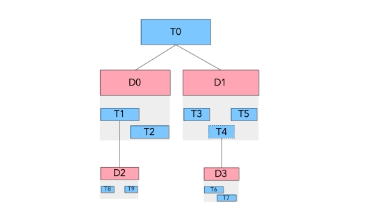

# Work Breakdown Structures

## Problem description

This formulation describes a complex Work-Breakdown Structure (WBS) of a project. The project consists of `N` tasks whose decomposition structures are provided. A given decomposition consists of a parent task and a set of subtasks.

A given task may be the parent of several decompositions, meaning that there are alternative ways to decompose the task (for instance in the figure below, there are two ways to decompose task T0, either D0 or D1). In this case, deciding which decomposition is selected is part of decisions of the problem. A given sub-task may be compulsory in the decomposition it belongs to, meaning that whenever the decomposition is selected the sub-task must be executed. Otherwise the execution of the sub-task is optional (in the figure below, task T4 in dotted line is optional, meaning that one could decide to select decomposition D1 of task T0 but without executing task T4 and thus, without its subtasks T6 and T7). 

The decomposition structure may have arbitrary levels of tasks and decompositions.

## CP Optimizer formulation

> NOTE: _The conventions for typesetting CP Optimizer models are available [here](../../typeset_models/README.md)_

    Given:
     N                   # Number of tasks
     D                   # Number of decompositions
     P[j] : j in [1..D]  # Parent task of decomposition j
     S[j] : j in [1..D]  # Set of sub-tasks of decomposition j 
     C[i] : i in [1..N]  # C[i] is false if and only if task i is 
                         # compulsory in the decompositions it belongs to
    
    Let:
     D[i] = { j : j in [1..D] | P[j]=i }             # Alternative decompositions of task i
     NP[i] = card( { j : j in [1..D] | i in S[j] } ) # Number of parent tasks of task i
     
    interval x[i], optional                : i in [1..N]                   # Tasks i
    interval y[j], optional                : j in [1..D]                   # Decomposition j
    
    presenceOf(x[i])                       : i in [1..N] | NP[i]=0, C[i]   # (1) Top level tasks
    alternative(x[i], y[j] : j in D[i])    : i in [1..N] | 0<card(D[i])    # (2) Task decompositions
    span(y[j], x[i] : i in S[j])           : j in [1..D]                   # (3) Decompositions span their sub-tasks
    presenceOf(y[j]) => presenceOf(x[i])   : j in [1..D], i in S[j] | C[i] # (4) Presence of compulsory sub-tasks

The formulation defined two sets of interval variables (al are optional by default): the task intervals `x[i]` and the decomposition intervals `y[j]`.

Constraint (1) state that top-level tasks (the ones with no parent) that are compulsory should be present. In case the task has some decomposition (thus, it is not a leaf of the WBS), an alternative constraint is posted between the task and its possible alternative decompositions in constraints (2). Each of the possible decompositions is then constrained to span their subtasks in constraints (3). Finally, for each sub-task of a decomposition that is compulsory, (4) posts implication constraints stating that whenever the decomposition is selected, the sub-task should be present. 

The model only describes the constraints related with the WBS: in a real problem one would of course need to add additional constraints like precedence constraints between sub-tasks in a decomposition and constraints relating to resources. These constraints would be posted directly between the optional interval variables `x[i]`. It is important to notice that the complete model would not involve any meta-constraint (except for the binary constraints on presence statuses (4) which are efficiently aggregated and exploited by the engine).

## Code samples

The corresponding formulation in OPL is here : [wbs.py](./python/wbs.py)

